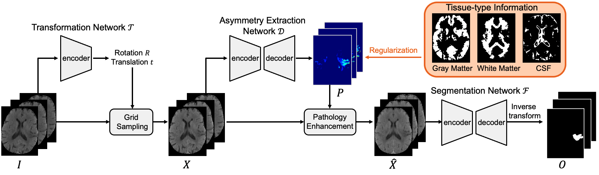
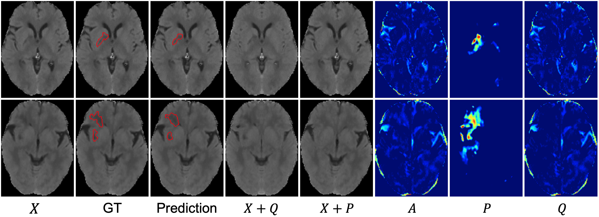

ADN
====

The Pytorch implementation of our MICCAI22 paper [Asymmetry Disentanglement Network for Interpretable Acute Ischemic Stroke Infarct Segmentation in Non-Contrast CT Scans.](https://arxiv.org/pdf/2206.15445.pdf)

<div align=center></div>

Example Results
----

ADN can separate different kinds of asymmetries in NCCT images ( $A$: total asymmetry map, $P$: pathologigcal asymmetry map, $Q$: intrinsic anatomical asymmetry map) and generate pathology-salient ( $X+Q$ ) or pathology-compensated ( $X+P$ ) images for better clinical examination. 

<div align=center></div>

Dependencies
----
Python 3.7.10, Pytorch 1.10.2, etc.

Quick Start
----
ADN includes three parts: transformation network $T$, assymmetry extraction network $D$, and segmentation network $F$. In our experiments, we first train $T$, and then fix $T$ and jointly train $D$ and $F$. The following codes show a simple example that how to train the network $T$.
```python
# A toy example to show how to train transform network
import os
import torch
from model.transform_net import PlaneFinder
import torch.optim as optim

# set GPU
os.environ["CUDA_VISIBLE_DEVICES"] = "0"

# transformation network T
align_model = PlaneFinder(is_train=True)
align_model.train()
align_model.cuda()

optimizer = optim.AdamW(align_model.parameters(),
                        lr=1e-5, betas=(0.9, 0.999), weight_decay=5e-4)

# load CT data
# size: (batch_size, num_channel, num_slices, height, width)
x = torch.rand((4, 1, 40, 256, 256)).cuda()

optimizer.zero_grad()

# x_t: transformer symmetric x
# view: x, y, z rotation and translation
# M: transformation matrix
# please refer to the comments of forward function for the definition of each return variable
x_t, _, _, view, M, _ = align_model(x)

align_model.loss_total.backward()

optimizer.step()
```
After training $T$, we jointly train $D$ and $F$. The following codes show a simple example about how to implement this. We first set `warm_start=1` in the begining stages and then set `warm_start=0`.
```python
# A toy example to show how to train the whole network without using tissue segmentation maps
# unet3d is borrowed from https://github.com/wolny/pytorch-3dunet/tree/master/pytorch3dunet/unet3d
import os
os.environ["CUDA_VISIBLE_DEVICES"] = "0"
import torch
from model.transform_net import PlaneFinder
import torch.optim as optim
import torch.nn as nn
from model.unet3d.unet_model import ResidualUNet3D
from model.unet3d.losses import GeneralizedDiceLoss

# affine transform
def stn(x, theta):
    # theta must be (Bs, 3, 4) = [R|t]
    grid = nn.functional.affine_grid(theta, x.size(), align_corners=False)
    out = nn.functional.grid_sample(x, grid, padding_mode='zeros', align_corners=False)
    return out

def loss_calc(pred, label):
    """
    This function returns cross entropy loss for semantic segmentation
    """
    label = label.cuda()
    BCELoss = nn.BCELoss()
    DiceLoss = GeneralizedDiceLoss(normalization="none")
    return BCELoss(pred, label), DiceLoss(pred.unsqueeze(dim=1), label.unsqueeze(dim=1))

# transformation network T
align_model = PlaneFinder(is_train=False)
align_model.cuda()
# load pretrained transformation network T
# Note that we train T first and then fixed it and train D and F
align_model.eval()

# asymmetry extraction network D
asym_model = ResidualUNet3D(in_channels=1, out_channels=1, f_maps=32, use_transconv=False, use_dp=True, p=0.2)
asym_model.cuda()
asym_model.train()

# segmentation network F
seg_model = ResidualUNet3D(in_channels=1, out_channels=1, f_maps=32, use_transconv=False, use_dp=True, p=0.2)
seg_model.cuda()
seg_model.train()

optimizer = optim.AdamW([{'params': asym_model.parameters(), 'lr': 1e-4},
                         {'params': seg_model.parameters(), 'lr': 1e-4}],
                        weight_decay=5e-4,
                        betas=(0.9, 0.999))

# load CT data
# size: (batch_size, num_channel, num_slices, height, width)
images = torch.rand((1, 1, 40, 256, 256)).cuda()
labels = torch.randint(size=(1, 40, 256, 256), low=0, high=2).float().cuda()

# Perform transformation
with torch.no_grad():
    images_t, images_r, images_t_f, _, M, M_inv = align_model(images)
    diff_t = images_t - images_t_f
    sym_comp_t = torch.zeros_like(images_t)
    sym_comp_t[diff_t > 0] = images_t[diff_t > 0]
    sym_comp_t[diff_t == 0] = images_t[diff_t == 0]
    sym_comp_t[diff_t < 0] = images_t_f[diff_t < 0]
    asym_map_t = nn.ReLU()(images_t_f - images_t)  # total asym map A

labels_t = stn(labels.unsqueeze(dim=1), M[:, :3, :]).squeeze(dim=1)

optimizer.zero_grad()
# separate asym to be anatomical asym Q and pathological asym P
subject_asym_conf_t = asym_model(images_t)  # pathological asym P
anatomy_asym_conf_t = asym_map_t - subject_asym_conf_t
anatomy_asym_conf_t = nn.ReLU()(anatomy_asym_conf_t)  # anatomical asym P
subject_asym_images_t = images_t + anatomy_asym_conf_t  # X_hat = X + Q

anatomy_asym_images_t = images_t + subject_asym_conf_t
anatomy_asym_images_t = torch.clamp(anatomy_asym_images_t, max=sym_comp_t)  # X_bar = X + P

# perform segmentation on X_hat
pred_t = seg_model(subject_asym_images_t)
pred_t = pred_t.squeeze(dim=1)
bce_loss, dice_loss = loss_calc(pred_t, labels_t)
seg_loss = bce_loss + dice_loss

lambda_seg = 1
lambda_reg = 10
warm_start = 1  # 1 use warm start else use regularization loss
# for warm start stage
if warm_start:
    reg_bce_loss, reg_dice_loss = loss_calc(subject_asym_conf_t.squeeze(dim=1), labels_t)
    reg_loss = reg_bce_loss + reg_dice_loss
else:
    subject_asym_msk_t = labels_t.unsqueeze(dim=1) == 1
    subject_asym_gt_t = asym_map_t * subject_asym_msk_t
    # 1. the size of subject asym (i.e. pathological asym) should be similar to the size of stroke
    reg_loss1 = nn.L1Loss()(subject_asym_conf_t.mean(), subject_asym_gt_t.mean())
    # 2. subject asym should from subject + anatomy
    sym_map_mask_t = asym_map_t == 0
    reg_loss2 = nn.L1Loss()(subject_asym_conf_t*sym_map_mask_t, torch.zeros_like(subject_asym_conf_t))
    # 3. anatomical asym should as large as possible
    reg_loss3 = -anatomy_asym_conf_t.mean()
    reg_loss = reg_loss1 + reg_loss2 + reg_loss3

loss = lambda_seg * seg_loss + lambda_reg * reg_loss
loss.backward()
optimizer.step()
```
DONE
----
The network structure of ADN

The code of complete process of training and testing 

TODO
----
The illustration of data preparation, training and testing

Citing ADN
----
If you find our approaches useful in your research, please consider citing:
```
@InProceedings{10.1007/978-3-031-16452-1_40,
author="Ni, Haomiao
and Xue, Yuan
and Wong, Kelvin
and Volpi, John
and Wong, Stephen T. C.
and Wang, James Z.
and Huang, Xiaolei",
title="Asymmetry Disentanglement Network for Interpretable Acute Ischemic Stroke Infarct Segmentation in Non-contrast CT Scans",
booktitle="Medical Image Computing and Computer Assisted Intervention -- MICCAI 2022",
year="2022",
publisher="Springer Nature Switzerland",
address="Cham",
pages="416--426",
isbn="978-3-031-16452-1"
}
```
For questions with the code, please feel free to contact me: homerhm.ni@gmail.com

Acknowledgement
-----
Part of our code was borrowed from [unsup3d](https://github.com/elliottwu/unsup3d) and [unet3d](https://github.com/wolny/pytorch-3dunet/tree/master/pytorch3dunet/unet3d). We thank the authors of these repositories for their valuable implementations.

